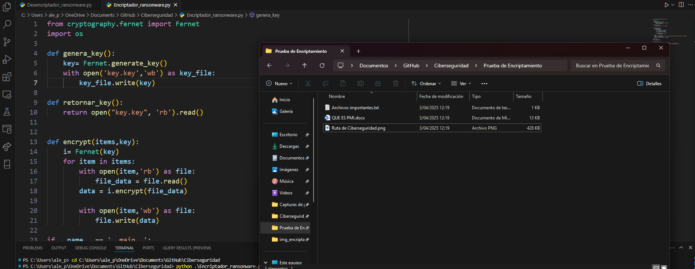
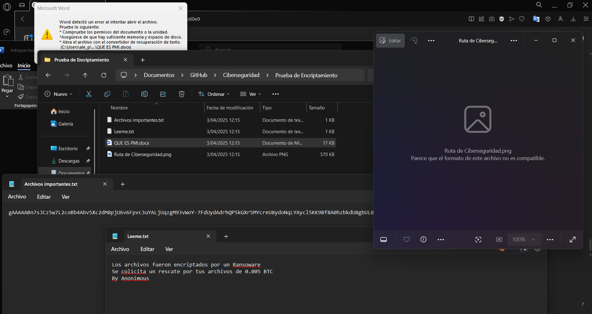
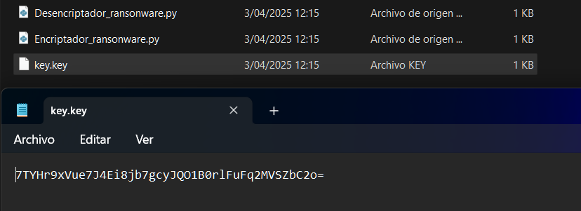
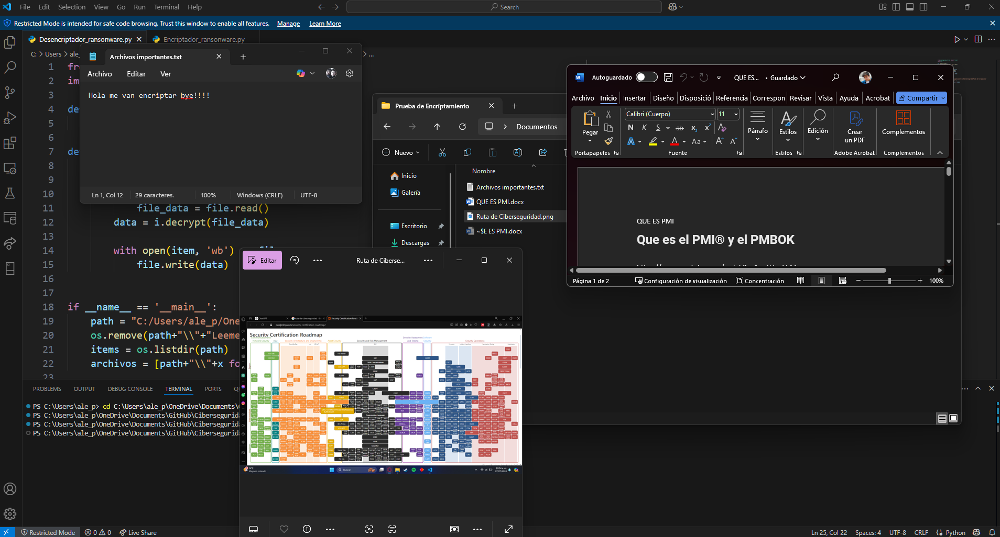

# 🦠 **Ransomware y Desencriptación en Python**

## ✨ **Descripción**

Este proyecto simula un ataque de **ransomware** utilizando la librería `cryptography` en Python. El ataque encripta archivos dentro de un directorio especificado y guarda una clave secreta (`key.key`) para su posterior desencriptación. Además, se crea un archivo **`Leeme.txt`** con un mensaje solicitando un rescate.

### 🔐 **Funciones:**

1. **Encriptar Archivos**: Cifra todos los archivos en un directorio especificado usando una clave generada aleatoriamente.
2. **Desencriptar Archivos**: Usa la clave guardada (`key.key`) para devolver los archivos a su estado original.

---

## ⚙️ **Instalación**

1. **Instalar dependencias**:

   Asegúrate de tener Python instalado en tu máquina. Luego, instala la librería `cryptography` ejecutando el siguiente comando:

   ```bash
   pip install cryptography
   ```

## 📥 **Modo de Uso**

Para usar este proyecto, sigue los siguientes pasos:

---

## 1️⃣ **Encriptar Archivos**

Asegúrate de que la ruta del directorio de tus archivos a encriptar esté correctamente configurada en la variable `path` dentro del script **`Encriptador_ransomware.py`**.



**Ejecuta el siguiente comando para encriptar los archivos:**

```bash
    python Encriptador_ransomware.py
```
   

   Esto encriptará todos los archivos en el directorio y creará una clave secreta (key.key) necesaria para desencriptar los archivos más tarde. También generará un archivo Leeme.txt con el mensaje de rescate.
   
## 2️⃣ **Desencriptar Archivos**

Asegúrate de tener el archivo **`key.key`** (que contiene la clave de desencriptación) y los archivos encriptados en el directorio donde se encuentran.

### Pasos para desencriptar:

1. Asegúrate de tener la **clave secreta** (key.key) y los archivos encriptados listos en el directorio.

2. Ejecuta el siguiente comando en tu terminal:

    ```bash
    python Desencriptador_ransonware.py
    ```

---

### **Foto del proceso de desencriptación:**



---

### 🚨 **Advertencia:**

Si la clave **`key.key`** se pierde o se modifica, **los archivos no podrán ser desencriptados** y se perderá toda la información de manera **irreversible**.


## 3️⃣ **Advertencias**

### 1️⃣ **Precaución con las Rutas**

Asegúrate de que las rutas en los scripts (`path`) estén correctamente configuradas para que apunten al directorio correcto donde están tus archivos.

---

### 2️⃣ **Pérdida de Archivos**

Si pierdes la clave **`key.key`**, los archivos encriptados no podrán ser restaurados y se perderán de forma irreversible.

---

### 3️⃣ **Uso Responsable**

Este código está destinado solo para fines educativos. No utilices este proyecto para actividades maliciosas. La responsabilidad de su uso recae completamente sobre el usuario.
